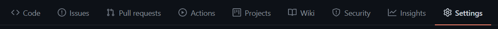
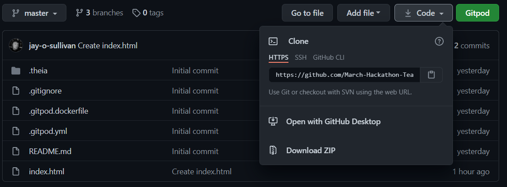

# What's The Craic?

A compact collection of simple Irish themed games or trivia which can be enjoyed across a video call by multiple households - enabling celebration of St Patrick's Day together, but apart!

1. A landing page that explains the website's function and contains links to additional pages. 
1. Selection of trivia flip cards to try out knowledge of Irish language.
2. A quiz for households to compare Irish general knowledge.
3. Game of prompts, Irish themed categories where households vote for the best answer!

## UX

*-------------Am I Responsive Image here?------------------*

### User Stories
* As a first time user, I want to find out what activities the site offers and how easy they are to use, so that I can decide whether it suits the needs of my party.
* As a first time user, I want to be able to easily navigate to each game and try them to see if I think my party will enjoy them.
* As a first time user, I want to easily learn what each game involves and how it works, so that I can share the idea with my party.
* As a returning user, I want to easily access the first game my party wish to play, so that I can share it with them.
* As a returning user, I want to easily share the game content on my screen without too much scrolling or manipulation of the page, so that I can focus on the experience of the game.
* As a regular user, I want to get straight to the content of the game I wish to play, so that I can get straight to enjoying my social experience.
* As a regular user, I want to be made aware of any changes or additions to the website, so that I can try them out.

### Wireframes
* [Home](#)
* [Trivia](#)
* [Quiz](#)
* [Quiplash](#)

## Features
Each page features consistent design to facilitate an intuitive and comfortable user experience.  There is a central home page with links directly to each game for quick and easy use.

The website has a number of games to choose from, meaning users do not have to switch through various sites to facilitate their celebration.
1. Trivia - Designed as a conversation feeder, an interesting and topical interactive experience to encourage dialog amongst participants.
2. Quiz - An interactive general Irish knowledge quiz.  Households can each open the page to complete the quiz and track their score, or all households can work together to try to beat the game and get top marks.  Set length to quiz to provide structure.
3. Prompts - An open ended interactive game where a card is drawn and each household ventures an answer.  The other households vote for their favourite, keeping score off-site.  There is no set length to this game.

### Existing Features
* Nav bar in universal standard position to help users feel intuitively at home with the site.  Uniform across all pages.
* Bright, on-theme design to help users feel part of a wider celebration.
* Uniform footer on every page.

*--------------------Game featues here--------------------*

### Features Left to Implement
* Additional cards
* Accounts and login to manage scoring retention and management
* Leaderboard

## Technologies Used
* [HTML5](https://en.wikipedia.org/wiki/HTML5)
* [CSS3](https://www.w3.org/TR/2001/WD-css3-roadmap-20010523/)
* [Javascript](https://www.javascript.com/)

### Additional Technologies
*If adding wireframes or Balsamiq

## Resources
* https://www.pexels.com/ - Images for Memory Game
* https://pixabay.com/ - Images for Memory Game & Translation Flashcards
* http://www.makethumbnails.com/#dropzone - Resizing images for Memory Game
* https://www.freecodecamp.org/news/vanilla-javascript-tutorial-build-a-memory-game-in-30-minutes-e542c4447eae/ - Inspiration for Memory Game
* https://pixabay.com/illustrations/st-patricks-day-background-clover-2141384/ - Background for Quiz 
* https://learn.codeinstitute.net/ci_program/diplomainsoftwaredevelopment - Inspiration for Javascript for incrememting score on quiz.html
* https://www.w3schools.com/howto/howto_css_flip_card.asp - Flip cards tutorial for translation.html flashcards
## Testing
* Tested across multiple internet explorers including Chrome, Microsoft Edge, Brave and Ecosia.
...

## Deployment
The website was created using [GitPod](https://www.gitpod.io/). Version control was undertaken by committing to [Git](https://git-scm.com/) and pushing to [GitHub](https://github.com/) using the functions within GitPod.

### Deployment of the Page
1. In GitPod, ensure the tree is clean, and all required items have been committed and pushed to the repository in GitHub.
2. Sign in to GitHub.
3. A list of repositories should display on the left of the page. Choose the appropriate repository: lilblupig/curls-ms1
4. From the repository menu, choose Settings.

5. Scroll down the page to find the Pages section.
6. From the first dropdown box, choose the Master branch, then click save.

7. The page will refresh, and the Pages section now shows a URL for the deployed site.
8. Click the URL to view the deployed website.

### How to Run the Code Locally
There are slightly different approaches should you choose to use GitPod to clone the project, or a local IDE.

#### Cloning a Project into GitPod
1. Use [Google Chrome](https://www.google.com/intl/en_uk/chrome/). *(This can also be undertaken in Firefox)*
2. If you do not already have one, [create a GitHub account](https://github.com/join).
3. Install the [GitPod browser extension for Chrome](https://chrome.google.com/webstore/detail/gitpod-dev-environments-i/dodmmooeoklaejobgleioelladacbeki).
4. Restart Chrome.
5. In GitHub, find the [project repository](https://github.com/March-Hackathon-Team-27/Hackathon-Project-canRename-).
6. From the repository menu, choose the green GitPod button.

7. A new GitPod workspace will open containing the project code.

#### Cloning a Project into a Local IDE
1. Navigate to the [GitHub Repository](https://github.com/March-Hackathon-Team-27/Hackathon-Project-canRename-).
2. Choose the Code dropdown menu, and copy the URL.

3. Open your local IDE and then open a terminal.
4. Set the current working directory to your preferred location for the cloned project.
5. Type in "git clone " followed by the copied URL. Be sure to include a space between git clone and the url, then press enter.
6. The cloned project will be created.

You can find more information on cloning a repository from GitHub [here](https://docs.github.com/en/github/creating-cloning-and-archiving-repositories/cloning-a-repository).

## Credits

### Website Credits

#### Content
* All original content on this website contributed by members of Hackathon Team 27. 

#### Media
The photos used in this site were obtained from:
* https://www.pexels.com/
* https://pixabay.com/

#### Acknowledgements
* This project was created using the following resources:
  * [Code Institute Full Template](https://github.com/Code-Institute-Org/gitpod-full-template).

* We would like to thank the team at Code Institute for organizing this Hackathon and providing the materials in the course for us to apply to the projects.
* Also mentor Felipe Souza Alarcon for sound advice and guidance. 

